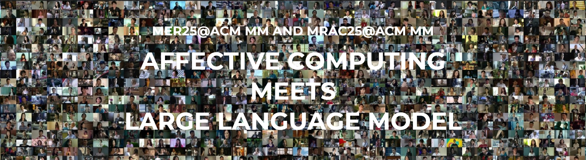

# MER2025 Dataset

Welcome to the official dataset for the **[MER2025 Challenge@ACM MM](https://zeroqiaoba.github.io/MER2025-website/)**!

MER2025 marks the third edition of our **Multimodal Emotion Recognition (MER)** series of challenges, aiming to bring together the affective computing community to explore emerging trends and future directions. This year, MER2025 focuses on the theme:  
### **"Affective Computing Meets Large Language Models"**

We seek to shift from traditional categorical emotion recognition frameworks, which rely on predefined taxonomies, towards **LLM-driven generative methods**, offering innovative solutions for more accurate and interpretable emotion understanding.

Baseline code is available here: [MERTools for MER2025](https://github.com/zeroQiaoba/MERTools/tree/master/MER2025)

---

## 🌐 News

- **April 30, 2025**: MER25 Challenge and MRAC25 Workshop website launched!

---

## 🔥 Challenge Tracks

MER2025 features four tracks:

### Track 1. MER-SEMI
Enhancing categorical emotion recognition through **semi-supervised learning**.  
Participants are encouraged to leverage methods such as masked auto-encoders and contrastive learning to improve performance using both labeled and unlabeled data.

- Predict one label from six categories: **worried, happy, neutral, angry, surprise, sad**.

### Track 2. MER-FG
Moving beyond basic emotions to **fine-grained emotional states**[1, 2].  
Participants can use LLMs to predict **any emotion labels**, capturing more nuanced emotional expressions.

### Track 3. MER-DES
Integrating **multimodal clues** for **explainable emotion recognition**[2, 3].  
Instead of relying solely on emotion words, participants must submit **both multimodal evidence and emotion labels**, enhancing interpretability.

### Track 4. MER-PR
Exploring the relationship between **emotion recognition and personality prediction**.  
Participants are encouraged to use techniques like multi-task learning to determine whether better emotion recognition improves personality prediction.

- Related references:
  - [1] OV-MER: Towards Open-Vocabulary Multimodal Emotion Recognition. [arXiv:2410.01495](https://arxiv.org/abs/2410.01495)
  - [2] AffectGPT: A New Dataset, Model, and Benchmark for Emotion Understanding with Multimodal Large Language Models. [arXiv:2501.16566](https://arxiv.org/abs/2501.16566)
  - [3] Explainable Multimodal Emotion Recognition. [arXiv:2306.15401v5](https://arxiv.org/abs/2306.15401)

---

## 📂 Dataset Access

- **Academic use only**: Access to the dataset requires signing an EULA (End-User License Agreement).
- **No redistribution**: Uploading the dataset to any public platform or modifying it is prohibited.
- **Approval required**: After submitting the EULA on Hugging Face, access will be granted upon approval.

## 📥 Access Instructions

After your access request has been approved, the dataset download instructions will be provided in the file:  
**`README_AFTER_APPROVAL.md`**

Please carefully review the LICENSE and EULA requirements before submitting your access request.

---

## 🧪 Result Submission

- For **MER-SEMI**, **MER-FG**, and **MER-DES**:
  - Submit predictions for **20,000** selected candidate samples (subsets of the original 124k unlabeled samples).
- For **MER-PR**:
  - Submit predictions directly on the provided test set.

Each track has different prediction formats and targets as described above.

---

## 📝 Paper Submission

All participants are highly encouraged to submit a paper describing their proposed solutions to the **Workshop Proceedings** or **Challenge Proceedings**, held as part of ACM Multimedia 2025.

- **Baseline paper**: https://arxiv.org/abs/2504.19423
- **Baseline code**: https://github.com/zeroQiaoba/MERTools/tree/master/MER2025
- **Contact email**: merchallenge.contact@gmail.com; lianzheng2016@ia.ac.cn
---

## 📅 Important Dates

| Event | Date |
| :--- | :--- |
| Data, baseline paper & code available | April 30, 2025 |
| Results submission start | June 26, 2025 |
| Results submission deadline | July 10, 2025 |
| Paper submission deadline | July 20, 2025 |
| Paper acceptance notification | August 1, 2025 |
| Camera-ready paper deadline | August 11, 2025 |
| MRAC25 Workshop@ACM MM (Dublin, Ireland) | Oct 27-31, 2025 |

> ⏰ All deadlines are **23:59 Anywhere on Earth (AoE)**.

---

## 📫 Contact

For any questions, collaborations, or issues:
> **merchallenge.contact@gmail.com**

You can also raise an issue in the [MERTools GitHub repository](https://github.com/zeroQiaoba/MERTools/tree/master/MER2025).

---

# 🛡️ License

© 2025 Intelligent Interaction Group. All rights reserved.

This dataset is made available for **academic research purposes only** under a custom End-User License Agreement (EULA) and a [customized CC BY-NC 4.0 License](https://github.com/zeroQiaoba/MERTools/blob/master/MER2025/LICENSE) with additional usage restrictions.

**Users must:**
- Sign and submit the EULA.
- Obtain approval before accessing the data.
- Use the dataset solely for non-commercial academic research purposes.
- Not modify, redistribute, or publish the dataset or any derivative works without prior written consent.

📄 Please refer to the [LICENSE file](https://github.com/zeroQiaoba/MERTools/blob/master/MER2025/LICENSE) for full license and usage details.

---